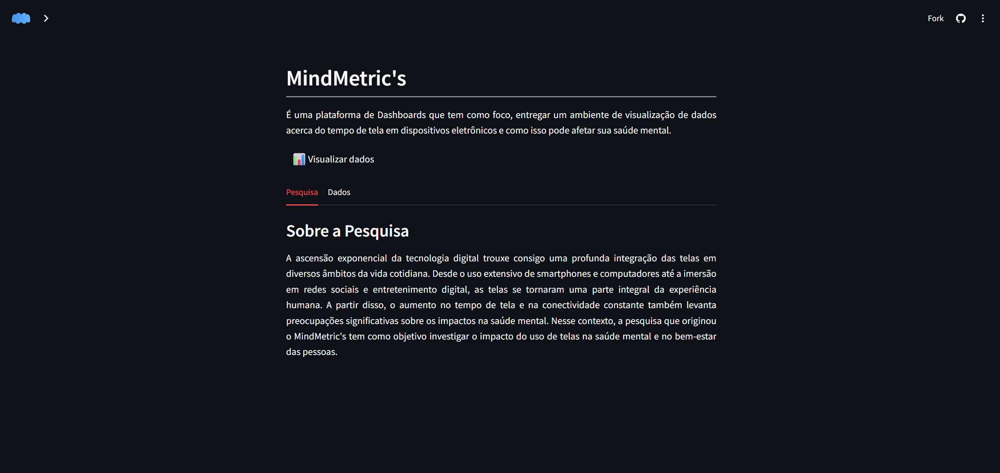
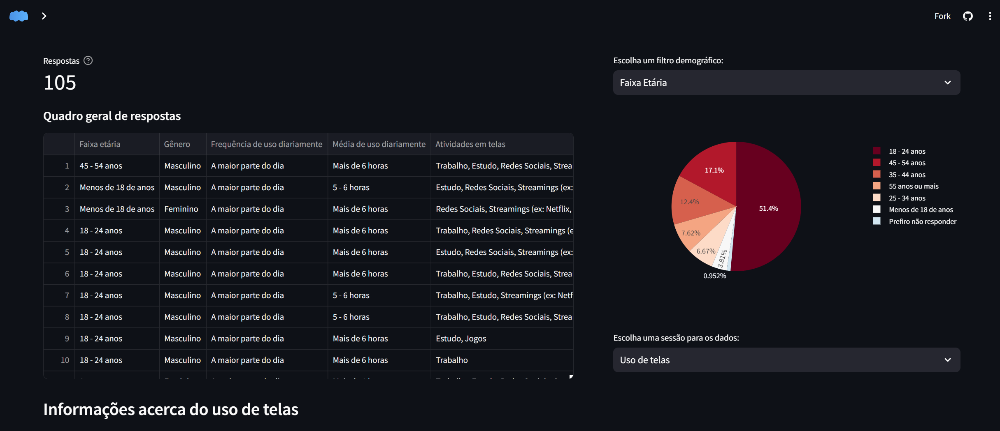
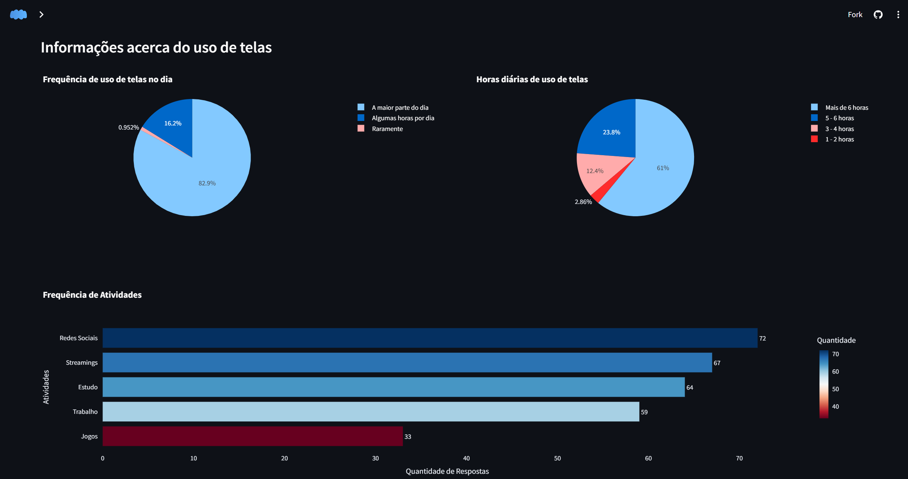
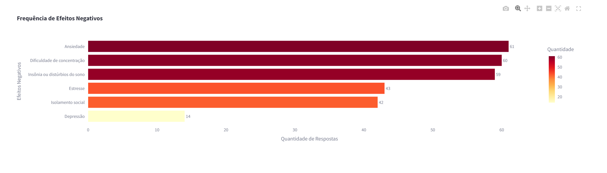
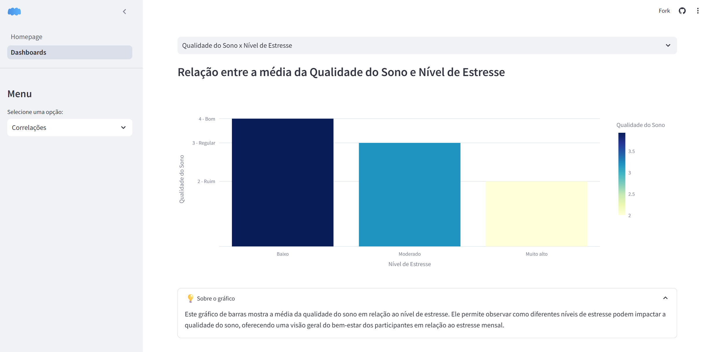
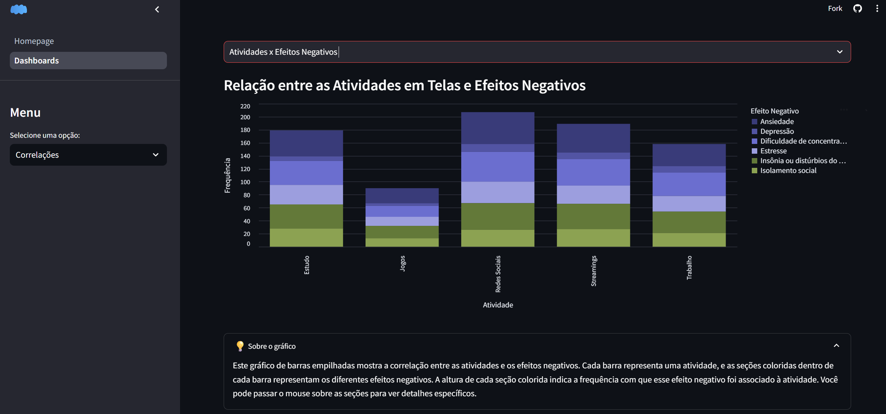

<div align="center">

# MindMetrics

### Análise do Impacto do Uso de Telas na Saúde Mental através de Ciência de Dados

[](https://mindmetric.streamlit.app/)
[](https://www.python.org/downloads/)
[](LICENSE)

[Demo ao Vivo](https://mindmetric.streamlit.app/) | [Documentação](#índice) | [Instalação](#instalação) | [Metodologia](#metodologia)

</div>

---

## Índice

- [Visão Geral](#visão-geral)
- [Contexto e Motivação](#contexto-e-motivação)
- [Funcionalidades](#funcionalidades)
- [Demonstração](#demonstração)
- [Arquitetura e Tecnologias](#arquitetura-e-tecnologias)
- [Instalação](#instalação)
- [Estrutura do Projeto](#estrutura-do-projeto)
- [Metodologia](#metodologia)
- [Resultados e Insights](#resultados-e-insights)
- [Uso da Aplicação](#uso-da-aplicação)
- [Licença](#licença)

---

## Visão Geral

**MindMetrics** é uma plataforma de análise de dados desenvolvida como Trabalho de Conclusão de Curso em Ciência da Computação. O sistema tem como objetivo investigar e visualizar os impactos do uso de dispositivos eletrônicos na saúde mental através de dashboards interativos e análises estatísticas.

A plataforma processa e analisa dados coletados por meio de pesquisa quantitativa com 105 respondentes, explorando correlações entre padrões de uso de telas e indicadores de bem-estar psicológico, incluindo qualidade do sono, níveis de estresse e efeitos adversos percebidos.

### Objetivos do Projeto

- Fornecer visualizações interativas de dados comportamentais relacionados ao uso de tecnologia
- Identificar e quantificar correlações entre tempo de exposição a telas e indicadores de saúde mental
- Democratizar o acesso a análises estatísticas sobre o impacto digital no bem-estar
- Contribuir para o debate acadêmico sobre os efeitos da tecnologia na saúde mental

---

## Contexto e Motivação

A ascensão exponencial da tecnologia digital trouxe consigo uma profunda integração das telas em diversos âmbitos da vida cotidiana. Desde o uso extensivo de smartphones e computadores até a imersão em redes sociais e entretenimento digital, as telas se tornaram uma parte integral da experiência humana.

O aumento no tempo de tela e na conectividade constante levanta preocupações significativas sobre os impactos na saúde mental. Esta pesquisa busca investigar essas relações de forma empírica, fornecendo uma base quantitativa para compreender como diferentes padrões de uso de dispositivos eletrônicos se correlacionam com o bem-estar psicológico dos indivíduos.

---

## Funcionalidades

### Módulo de Análise de Pesquisa

O módulo principal oferece visualizações abrangentes dos dados coletados:

**Análise Demográfica**
- Distribuição de respondentes por faixa etária
- Segmentação por gênero
- Filtros interativos para análise de subgrupos

**Padrões de Uso de Telas**
- Frequência de uso diário de dispositivos eletrônicos
- Distribuição de horas diárias em telas
- Categorização de atividades digitais (Redes Sociais, Streamings, Trabalho, Estudo, Jogos)

**Indicadores de Bem-Estar**
- Avaliação da qualidade do sono no último mês
- Níveis de estresse autorrelatados
- Percepção de impacto das telas na saúde mental
- Frequência de efeitos negativos identificados

### Módulo de Correlações Estatísticas

Análises multivariadas implementadas:

**1. Média de Horas de Uso × Faixa Etária**
- Visualização de padrões de uso por grupo demográfico
- Identificação de faixas etárias com maior exposição a telas

**2. Qualidade do Sono × Nível de Estresse**
- Análise da relação entre indicadores de bem-estar
- Mapeamento de impactos do estresse na qualidade do sono

**3. Atividades Digitais × Efeitos Negativos**
- Correlação entre tipos de uso de telas e impactos adversos
- Identificação de atividades com maior associação a efeitos negativos

### Recursos Técnicos da Interface

- Interface responsiva adaptável a diferentes dispositivos
- Gráficos interativos com tooltips informativos
- Sistema de filtros dinâmicos para análise segmentada
- Tabelas de dados com ordenação e busca
- Explicações contextuais para cada visualização

---

## Demonstração

### Interface Principal

*A homepage apresenta o contexto da pesquisa e informações metodológicas sobre a coleta de dados, incluindo abas sobre a pesquisa e o processo de arrecadação de dados.*


### Dashboard de Análise

*Visualização completa dos 105 respondentes com:*
*Quadro geral de respostas individuais; Gráficos de distribuição demográfica; Análises segmentadas por uso de telas, bem-estar e efeitos negativos.*


### Análise de Correlações
#### Análise de Uso de Telas

*Gráficos de frequência e horas diárias de uso, distribuição de atividades digitais*

#### Indicadores de Bem-Estar

*Análise dos principais efeitos negativos reportados pelos respondentes*

#### Correlações Estatísticas

*Heatmap mostrando a relação entre qualidade do sono e níveis de estresse*


*Gráfico empilhado relacionando atividades digitais com efeitos negativos na saúde mental*


## Arquitetura e Tecnologias

### Stack Tecnológico

| Tecnologia | Versão | Função |
|------------|--------|--------|
| **Python** | 3.8+ | Linguagem de programação principal |
| **Streamlit** | 1.38.0 | Framework para aplicações web interativas |
| **Pandas** | 2.2.2 | Manipulação e análise de dados estruturados |
| **Plotly** | 5.24.1 | Biblioteca para visualizações interativas |
| **Altair** | 5.4.1 | Criação de gráficos declarativos |
| **openpyxl** | 3.1.2 | Leitura de arquivos Excel |

### Arquitetura da Aplicação

A aplicação segue uma arquitetura modular baseada em componentes:

```
Frontend (Streamlit) → Components → Utils → Data Layer
```

- **Frontend**: Interface do usuário com Streamlit
- **Components**: Componentes reutilizáveis de visualização
- **Utils**: Funções utilitárias para processamento de dados
- **Data Layer**: Camada de acesso e carregamento de dados

---

## Instalação

### Requisitos do Sistema

- Python 3.8 ou superior
- pip (Python package installer)
- 200MB de espaço em disco

### Processo de Instalação

**1. Clone o repositório**
```bash
git clone https://github.com/seu-usuario/mindmetrics.git
cd mindmetrics
```

**2. Configure o ambiente virtual**
```bash
# Criar ambiente virtual
python -m venv venv

# Ativar ambiente virtual
# Windows
venv\Scripts\activate

# Linux/macOS
source venv/bin/activate
```

**3. Instale as dependências**
```bash
pip install -r requirements.txt
```

**4. Execute a aplicação**
```bash
streamlit run Homepage.py
```

**5. Acesse a aplicação**

Abra o navegador e acesse: `http://localhost:8501`

### Configuração Alternativa (Docker)

```bash
# Build da imagem
docker build -t mindmetrics .

# Executar container
docker run -p 8501:8501 mindmetrics
```

---

## Estrutura do Projeto

```
mindmetrics/
│
├── Homepage.py                      # Ponto de entrada da aplicação
├── requirements.txt                 # Dependências do projeto
├── README.md                        # Documentação
│
├── assets/
│   └── icon.svg                     # Logo e ícones da aplicação
│
├── components/
│   ├── correlacoes.py              # Módulo de análise de correlações
│   └── pesquisa.py                 # Módulo de visualização da pesquisa
│
├── data/
│   └── pesquisa.xlsx               # Dataset da pesquisa (não versionado)
│
├── pages/
│   └── Dashboards.py               # Página de dashboards interativos
│
└── utils/
    ├── data_loader.py              # Carregamento e cache de dados
    └── data_processing.py          # Transformação e processamento
```

### Descrição dos Módulos

**Homepage.py**: Página principal com informações sobre o projeto e contexto da pesquisa.

**components/correlacoes.py**: Implementa as análises de correlação entre variáveis, incluindo processamento de dados categóricos e geração de visualizações estatísticas.

**components/pesquisa.py**: Responsável pela visualização dos dados brutos da pesquisa, incluindo distribuições demográficas e análises descritivas.

**utils/data_loader.py**: Gerencia o carregamento de dados com cache para otimização de performance.

**utils/data_processing.py**: Contém funções de transformação de dados, incluindo conversão de categorias em valores numéricos para análises quantitativas.

---

## Metodologia

### Coleta de Dados

A pesquisa foi conduzida seguindo rigorosamente as diretrizes da Lei Geral de Proteção de Dados (LGPD - Lei nº 13.709/2018):

**Princípios Aplicados:**
- Consentimento informado de todos os participantes
- Tratamento confidencial das informações coletadas
- Utilização exclusiva para fins acadêmicos e de pesquisa
- Anonimização completa das respostas
- Armazenamento seguro dos dados

**Características da Amostra:**
- **N = 105 respondentes**
- Diversidade de faixas etárias
- Distribuição variada por gênero
- Amostragem não probabilística por conveniência

### Variáveis Coletadas

**Variáveis Demográficas:**
- Faixa etária (categórica ordinal)
- Gênero (categórica nominal)

**Variáveis de Uso de Tecnologia:**
- Frequência de uso diário (categórica ordinal)
- Média de horas diárias em telas (categórica ordinal convertida para numérica)
- Principais atividades realizadas em dispositivos (categórica múltipla escolha)

**Variáveis de Saúde Mental:**
- Nível de estresse no último mês (escala categórica ordinal)
- Qualidade do sono no último mês (escala Likert 1-5)
- Avaliação subjetiva do impacto das telas (categórica)
- Efeitos negativos percebidos (categórica múltipla escolha)

### Processamento de Dados

**Etapas de Processamento:**

1. **Limpeza**: Remoção de respostas incompletas ou inconsistentes
2. **Transformação**: Conversão de variáveis categóricas em numéricas quando aplicável
3. **Normalização**: Padronização de categorias textuais (ex: unificação de plataformas de streaming)
4. **Agregação**: Cálculo de estatísticas descritivas e métricas de correlação
5. **Validação**: Verificação de integridade e consistência dos dados processados

### Análises Implementadas

**Análise Descritiva:**
- Distribuições de frequência para variáveis categóricas
- Medidas de tendência central para variáveis numéricas
- Visualizações de distribuição por gráficos de pizza e barras

**Análise Correlacional:**
- Correlações entre uso de telas e indicadores de bem-estar
- Análises estratificadas por grupos demográficos
- Identificação de padrões de associação entre atividades e efeitos

---

## Resultados e Insights

### Principais Descobertas

**Padrões de Uso:**
- 82.9% dos respondentes relatam usar telas a maior parte do dia
- 61% dos participantes reportam mais de 6 horas diárias de uso de telas
- Redes Sociais são a atividade mais frequente (68.6% dos respondentes)

**Impactos na Saúde Mental:**
- Ansiedade é o efeito negativo mais reportado (61 ocorrências)
- Dificuldade de concentração apresenta alta frequência (60 ocorrências)
- Insônia ou distúrbios do sono são relatados por 59 respondentes

**Correlações Identificadas:**
- Relação inversa entre níveis de estresse e qualidade do sono
- Variação significativa de horas de uso entre diferentes faixas etárias
- Associação entre tipos específicos de atividades digitais e efeitos negativos

### Limitações do Estudo

- Amostra não probabilística limita a generalização dos resultados
- Dados autorrelatados podem apresentar viés de resposta
- Natureza transversal da pesquisa impede inferências causais
- Ausência de grupo controle para comparação

---

## Uso da Aplicação

### Para Pesquisadores e Analistas

**Exploração de Dados:**
```python
from utils.data_loader import carregar_dados
from utils.data_processing import processar_dados_correlacao

# Carregar dataset
df = carregar_dados()

# Processar para análise
df = processar_dados_correlacao(df)

# Acessar dados processados
print(df.describe())
print(df.groupby('faixa_etaria')['horas_dia_num'].mean())
```

**Extensão de Análises:**
- Os módulos em `components/` podem ser adaptados para novas correlações
- Funções em `utils/` são reutilizáveis para outros datasets
- Estrutura modular facilita a adição de novos tipos de visualização

### Para Usuários Finais

**Navegação:**
1. Acesse a aplicação via browser
2. Explore a homepage para contexto da pesquisa
3. Navegue até "Dashboards" no menu lateral
4. Selecione "Pesquisa" para visualizações descritivas
5. Selecione "Correlações" para análises estatísticas
6. Utilize filtros demográficos para análises segmentadas

---

## Licença

Este projeto está licenciado sob a Licença MIT. Consulte o arquivo [LICENSE](LICENSE) para detalhes completos.

A Licença MIT permite uso comercial, modificação, distribuição e uso privado, com a condição de incluir o aviso de copyright original.